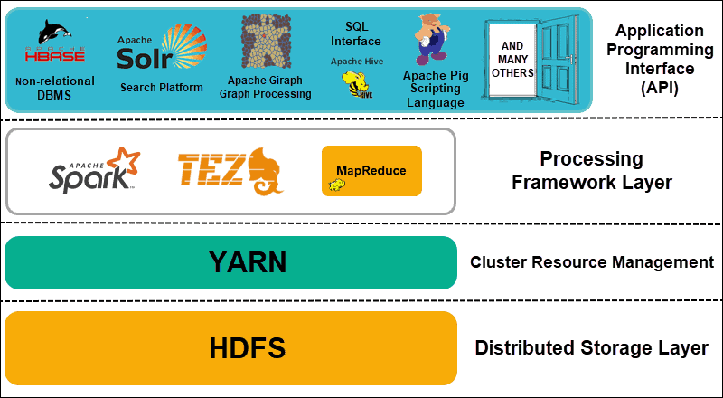

# Big data

## What is big data?

* Data sets that are too large or complex to be dealt with by traditional data-processing application software within a
  tolerable elapsed time. (wikipedia)
* Three key characteristics of big data:
  * Volume
  * Velocity
  * Variety

## Applications

* Product development: Used for building predictive models to increase user experience
* Business: Used for analyzing to predict trends and making business plans
* Machine learning: Used for training machine learning models

## Hadoop

### Overview

* An opensource framework that allows for the distributed processing of large data sets across clusters of computers
  using simple programming models.

### Architecture

### HDFS

A filesystem designed for storing very large files with streaming data access patterns, running on clusters of commodity
hardware

#### Block

* Disk block size: the minimum amount of data that it can read or write.
* Filesystems for a single disk build on this by dealing with data in blocks, which are an integral multiple of the disk
  block size.
  Filesystem blocks are typically a few kilobytes in size, whereas disk blocks are normally 512 bytes.
* HDFS block size: 128MB default.

#### Architecture

* Using master-slave architecture

* **Namenodes**
  * Namenode manages the filesystem namespace:

    * Maintains the filesystem tree and the metadata for all the files and directories in the tree.
      This information is stored persistently on the local disk in the form of two files: the namespace image (fsImage)
      and the edit log (EditLog).

    * Namespace means a container: in this context, it means the file name grouping or hierarchy structure.

    * Keeps a reference to every file and blocks in the filesystem **in memory**

* **Datanodes**
  * Store and retrieve blocks in command of clients or the namenode.
  * Report back to the namenode periodically with lists of blocks which they are storing.

### MapReduce

The major feature of MapReduce is to perform the distributed processing in parallel in a Hadoop cluster.

#### MapTask

- RecordReader The purpose of recordreader is to break the records. It is responsible for providing key-value pairs in a
  Map() function. The key is actually is its locational information and value is the data associated with it.
- Map: A map is nothing but a user-defined function whose work is to process the Tuples obtained from record reader. The
  Map() function either does not generate any key-value pair or generate multiple pairs of these tuples.
- Combiner: Combiner is used for grouping the data in the Map workflow. It is similar to a Local reducer. The
  intermediate key-value that are generated in the Map is combined with the help of this combiner. Using a combiner is
  not necessary as it is optional.
- Partitionar: Partitional is responsible for fetching key-value pairs generated in the Mapper Phases. The partitioner
  generates the shards corresponding to each reducer. Hashcode of each key is also fetched by this partition. Then
  partitioner performs it’s(Hashcode) modulus with the number of reducers(key.hashcode()%(number of reducers)).

#### Reduce Task

- Shuffle and Sort: The Task of Reducer starts with this step, the process in which the Mapper generates the
  intermediate key-value and transfers them to the Reducer task is known as Shuffling. Using the Shuffling process the
  system can sort the data using its key value.
  Once some of the Mapping tasks are done Shuffling begins that is why it is a faster process and does not wait for the
  completion of the task performed by Mapper.
- Reduce: The main function or task of the Reduce is to gather the Tuple generated from Map and then perform some
  sorting and aggregation sort of process on those key-value depending on its key element.
- OutputFormat: Once all the operations are performed, the key-value pairs are written into the file with the help of
  record writer, each record in a new line, and the key and value in a space-separated manner.
