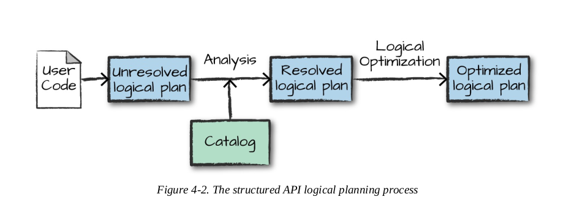
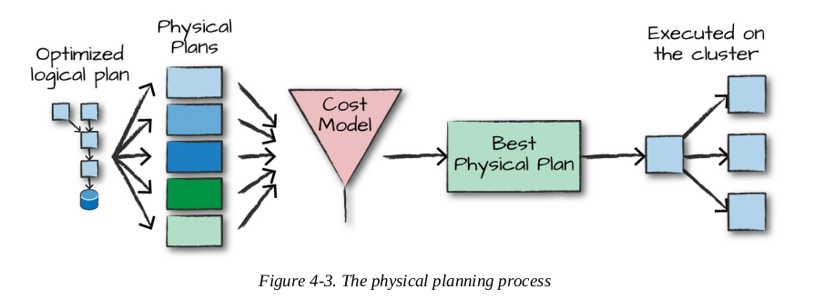

# Apache Spark
Spark is a unified analytics engine for large-scale data processing

## Architecture
### Cluster manager
Cluster manager will manage the clusters of machines Spark uses to execute tasks.
* Spark's standalone cluster manager.
* YARN.
* Mesos.

### Spark Applications
* Consists of two processes:
  * Driver:
    * Maintaining information about the Spark Application.
    * Responding to a user's program or input.
    * Analyzing, distributing and scheduling work across the executors.
  * Executor: responsible for carrying out the work that the driver assigns them.

* Spark applications need being submitted to the cluster manager, so that cluster manager will provide resources to the application to run.

## Spark APIs
Two fundamental sets of APIs:
* Low-level "unstructed" APIs.
* Higher-level structured APIs.

## Spark core
* DataFrames and Datasets are (distributed) table-like collections with well-defined rows and columns

### DataFrames
* The most common Structured API.
* Represents a table of data with rows and columns.
* Spark DataFrame can be partitioned and span thousands of computers, since the data is either too large to fit on one machine or it takes too long to perform the computation on one machine.
* A DataFrame consists of a series of records (like rows in a table) of type `Row`, and a number of columns that represent a computation expression that can be performed on each individual record in the Dataset.
* `Row`: Spark’s internal representation of its optimized in-memory format for computation, makes for highly specialized and efficient computation over JVM types.

### Dataset
* The foundational type of the structured APIs
* Using Dataset will slow down operation due to the conversion from type Row to the case class type.
* When to use Dataset:
  * When the operation(s) you would like to perform cannot be expressed using DataFrame manipulations
  * When you want or need type-safety, and you’re willing to accept the cost of performance to achieve it
* DataFrame is actually Dataset of type `Row`

### Transformations
* Core data structures in Spark are **immutable**.
* To change a DataFrame, need **transformations** to instruct Spark how to modify them.
* Transformations are the core of how to express business logic using Spark.
* Two types of transformations:
  * Narrow dependencies:
    * Each input partition will contribute to only one output partition.
    * Spark will automatically perform an operation called **pipelining**, meaning that if we specify multiple filters on DataFrames, they'll all be performed **in-memory**.

  * Wide dependencies:
    * Input partitions contributing to many output partitions.
    * Often referred to as a shuffle whereby Spark will exchange partitions across the cluster.
    * Results will be written to disk.

### Lazy evaluation
Spark will not evaluate transformations until it meets an action.

### Actions
* Must run an action to trigger the computation of logical transformation plan
* Three kinds of actions:
  * Actions to view data in the console
  * Actions to collect data to native objects in the respective language
  * Actions to write to output data sources

## Structured APIs

### Structured Spark types
* Spark uses an internal engine called Catalyst to maintain its own type information through the planning and processing of work.
  => This avoids using JVM types, which can cause high garbage-collection and object instantiation cost.

**Overview of structured APIs execution**

* The process of executing code on clusters:
  1. Write DataFrame/Dataset/SQL code.
  2. If code is valid, Spark converts it to a Logical Plan.
     
  3. Spark transforms this Logical Plan to a Physical Plan, checking for optimizations along the way.
     
  4. Spark then executes this Physical Plan (RDD manipulations) on the cluster.

* Logical plan: an abstract of all transformation steps that need to be executed.
* Physical plan: specifies how the logical plan will execute on the cluster.
* Catalog: a repository of all table and DataFrame information

### Basic structured operations
* Schemas define the name as well as the type of data in each column of Dataset (also DataFrame)
```
val df = spark.read.format("json")
  .load("/example/data.json")

df.printSchema()
```
* We can either let a data source define the schema (schema-on-read) or we can define it explicitly ourselves (schema-on-write).
  Schema-on-read may lead to wrong type inference.

* Manual define schema:
```
import org.apache.spark.sql.types.{StructField, StructType, StringType, LongType}
import org.apache.spark.sql.types.Metadata

val myManualSchema = StructType(Array(
  StructField("DEST_COUNTRY_NAME", StringType, true),
  StructField("ORIGIN_COUNTRY_NAME", StringType, true),
  StructField("count", LongType, false)
))

val df = spark.read.format("json")
  .schema(myManualSchema)
  .load("/example/data.json")
```

* Reference to columns:
```
df.col("col_name")
```

* Create DataFrames on the fly by taking a set of rows and converting them to a DataFrame
```
// in Scala
import org.apache.spark.sql.Row
import org.apache.spark.sql.types.{StructField, StructType, StringType, LongType}

val myManualSchema = new StructType(Array(
  new StructField("some", StringType, true),
  new StructField("col", StringType, true),
  new StructField("names", LongType, false))
)

val myRows = Seq(Row("Hello", null, 1L))
val myRDD = spark.sparkContext.parallelize(myRows)
val myDf = spark.createDataFrame(myRDD, myManualSchema)

myDf.show()
```
* Query data

  `select` and `selectExpr` allow you to do the DataFrame equivalent of SQL queries on a table of data
  ```
  // in Scala
  df.select("DEST_COUNTRY_NAME").show(2)

  df.selectExpr(
    "*", // include all original columns
    "DEST_COUNTRY_NAME as destination_country_name")
  .show(2)

  -- in SQL
  SELECT DEST_COUNTRY_NAME FROM dfTable LIMIT 2
  ```

* Add column
```
df.withColumn("withinCountry", expr("ORIGIN_COUNTRY_NAME == DEST_COUNTRY_NAME")).show(2)
```

* Rename column
```
df.withColumnRenamed("DEST_COUNTRY_NAME", "dest").columns
```

* Removing columns
```
df.drop("col1", "col2").columns
```

* Filtering rows
```
df.filter(col("count") < 2).show(2)
df.where("count < 2").show(2)

-- in SQL
SELECT * FROM dfTable WHERE count < 2 LIMIT 2
```

* Union
```
// in Scala
import org.apache.spark.sql.Row

val schema = df.schema
val newRows = Seq(
  Row("New Country", "Other Country", 5L),
  Row("New Country 2", "Other Country 3", 1L)
)

val parallelizedRows = spark.sparkContext.parallelize(newRows)
val newDF = spark.createDataFrame(parallelizedRows, schema)

df.union(newDF)
  .where("count = 1")
  .where($"ORIGIN_COUNTRY_NAME" =!= "United States")
  .show() // get all of them and we'll see our new rows at the end
```

* Sorting rows
```
// in Scala
df.sort("counter").show(5)
df.orderBy("counter", "DEST_COUNTRY_NAME").show(5)
df.orderBy(asc("counter"), desc("DEST_COUNTRY_NAME")).show(5)
df.orderBy(col("counter"), col("DEST_COUNTRY_NAME")).show(5)
```

* Collect rows to the driver
  Any collection of data to the driver can be a very expensive operation: driver can be crashed if the dataset is too large.
```
df.collect()
```

### User-defined functions

User-defined functions (UDFs) make it possible to write custom transformations

```
import org.apache.spark.sql.functions.udf

def power3(number:Double):Double = number * number * number

val udfExampleDF = spark.range(5).toDF("num")
val power3udf = udf(power3(_:Double):Double)

udfExampleDF.select(power3udf(col("num"))).show()
```

* Can be used as a SQL function
```
spark.udf.register("power3", power3(_:Double):Double)

udfExampleDF.selectExpr("power3(num)").show(2)
```

### Working with data types
* Null:
  * Remove rows contain nulls:
    ```
    df.na.drop()
    df.na.drop("any")
    ```

### Aggregations
**Aggregation functions**
#### `count`
```
// in Scala
import org.apache.spark.sql.functions.count

df.select(count("StockCode")).show() // 541909

-- in SQL
SELECT COUNT(*) FROM dfTable
```

#### `countDistinct`
```
// in Scala
import org.apache.spark.sql.functions.countDistinct

df.select(countDistinct("StockCode")).show() // 541909

-- in SQL
SELECT COUNT(DISTINCT *) FROM dfTable
```

#### `first` and `last`
```
// in Scala
import org.apache.spark.sql.functions.{first, last}

df.select(first("StockCode"), last("StockCode")).show()

-- in SQL
SELECT first(StockCode), last(StockCode) FROM dfTable
```

#### `min` and `max`
```
// in Scala
import org.apache.spark.sql.functions.{min, max}
df.select(min("Quantity"), max("Quantity")).show()

-- in SQL
SELECT min(Quantity), max(Quantity) FROM dfTable
```

#### `sum`
```
// in Scala
import org.apache.spark.sql.functions.sum
df.select(sum("Quantity")).show() // 5176450

-- in SQL
SELECT sum(Quantity) FROM dfTable
```

#### `sumDistinct`
```
// in Scala
import org.apache.spark.sql.functions.sumDistinct
df.select(sumDistinct("Quantity")).show() // 29310

-- in SQL
SELECT SUM(Quantity) FROM dfTable -- 29310
```

#### `avg`
```
// in Scala
import org.apache.spark.sql.functions.{sum, count, avg}
df.select(
    count("Quantity").alias("total_transactions"),
    sum("Quantity").alias("total_purchases"),
    avg("Quantity").alias("avg_purchases"))
 .selectExpr(
    "total_purchases/total_transactions",
    "avg_purchases").show()
```

#### Aggregating to complex types
```
// in Scala
import org.apache.spark.sql.functions.{collect_set, collect_list}
df.agg(collect_set("Country"), collect_list("Country")).show()

-- in SQL
SELECT collect_set(Country), collect_set(Country) FROM dfTable
```

**Grouping**
* Two phases:
  * Specify the column(s) need grouping on
  * Specify the aggregation(s)

* Grouping with Expressions
```
// in Scala
import org.apache.spark.sql.functions.count

df.groupBy("InvoiceNo").agg(
  count("Quantity").alias("quan"),
  expr("count(Quantity)")
).show()

-- in SQL
SELECT InvoiceNo, count(Quantity) as quan, count(Quantity) FROM dfTable
GROUP BY InvoiceNo
```

* Grouping with Maps
```
// in Scala
df.groupBy("InvoiceNo").agg("Quantity"->"avg", "Quantity"->"stddev_pop").show()

-- in SQL
SELECT avg(Quantity), stddev_pop(Quantity), InvoiceNo FROM dfTable
GROUP BY InvoiceNo
```

**Window functions**
```
// in Scala
import org.apache.spark.sql.expressions.Window
import org.apache.spark.sql.functions.{col, max, rank}

val windowSpec = Window
  .partitionBy("CustomerId", "date")
  .orderBy(col("Quantity").desc)

val maxPurchaseQuantity = max(col("Quantity")).over(windowSpec)
val purchaseRank = rank().over(windowSpec)

dfWithDate.where("CustomerId IS NOT NULL").orderBy("CustomerId")
.select(
  col("CustomerId"),
  col("date"),
  col("Quantity"),
  purchaseRank.alias("quantityRank"),
  maxPurchaseQuantity.alias("maxPurchaseQuantity")
).show()


-- in SQL
SELECT CustomerId, date, Quantity,
      rank(Quantity) OVER (PARTITION BY CustomerId, date ORDER BY Quantity DESC NULLS LAST) as rank,
      max(Quantity) OVER (PARTITION BY CustomerId, date ORDER BY Quantity DESC NULLS LAST) as maxPurchase
FROM dfWithDate
WHERE CustomerId IS NOT NULL 
ORDER BY CustomerId
```

**Grouping sets**

### Joins
```
// in Scala
val person = Seq(
  (0, "Bill Chambers", 0, Seq(100)),
  (1, "Matei Zaharia", 1, Seq(500, 250, 100)),
  (2, "Michael Armbrust", 1, Seq(250, 100))).toDF("id", "name", "graduate_program", "spark_status")

val graduateProgram = Seq(
  (0, "Masters", "School of Information", "UC Berkeley"),
  (2, "Masters", "EECS", "UC Berkeley"),
  (1, "Ph.D.", "EECS", "UC Berkeley")).toDF("id", "degree", "department", "school")

val sparkStatus = Seq(
  (500, "Vice President"),
  (250, "PMC Member"),
  (100, "Contributor")).toDF("id", "status")

person.createOrReplaceTempView("person")
graduateProgram.createOrReplaceTempView("graduateProgram")
sparkStatus.createOrReplaceTempView("sparkStatus")
```

#### Inner join
```
val joinExpression = person.col("graduate_program") === graduateProgram.col("id")
person.join(graduateProgram, joinExpression).show()

// with explicit join type
val joinType = "inner"
person.join(graduateProgram, joinExpression, joinType).show()
```

#### Left Outer join
```
val joinExpression = person.col("graduate_program") === graduateProgram.col("id")
val joinType = "left_outer"

person.join(graduateProgram, joinExpression, joinType).show()
```

#### Right Outer join
```
val joinExpression = person.col("graduate_program") === graduateProgram.col("id")
val joinType = "right_outer"

person.join(graduateProgram, joinExpression, joinType).show()
```

#### Cross join
```
val joinExpression = person.col("graduate_program") === graduateProgram.col("id")
val joinType = "cross"

person.join(graduateProgram, joinExpression, joinType).show()
```

### Datasource
* Spark’s core data sources:
  * CSV
  * JSON
  * Parquet
  * ORC
  * JDBC/ODBC connections
  * Plain-text files

#### Read data
`spark.read` returns a DataFrame reader, then we must specify several values:
* The `format`
* The `schema`
* The `read mode`
* Several `options`

```
spark.read.format("csv")
  .option("mode", "FAILFAST")
  .option("inferSchema", "true")
  .option("path", "path/to/file(s)")
  .schema(someSchema)
  .load()
```

**Read modes**

| Read mode      | Description                                  |
| ----------- |----------------------------------------------|
| permissive      | Sets all fields to null when it encounters a corrupted record and places all corrupted records in a string column called `_corrupt_record` |
| dropMalformed   | Drops the row that contains malformed records|
|failFast|Fails immediately upon encountering malformed records|

* Default: `permissive`

#### Write data
`spark.write` returns a DataFrame writer, then we must specify several values:
* The `format`
* The `save mode`
* Several `options`

```
// in Scala
dataframe.write.format("csv")
  .option("mode", "OVERWRITE")
  .option("dateFormat", "yyyy-MM-dd")
  .option("path", "path/to/file(s)")
  .save()
```

**Save modes**

| Save mode      | Description                                                                                                                                |
| ----------- |--------------------------------------------------------------------------------------------------------------------------------------------|
| append      | Appends the output files to the list of files that already exist at that location|
| overwrite   | Will completely overwrite any data that already exists there|
|errorIfExists| Throws an error and fails the write if data or files already exist at the specified location|
|ignore | If data or files exist at the location, do nothing with the current DataFrame |

* Default: `errorIfExists`

## Datasets
### Create dataset
```
case class Flight(DEST_COUNTRY_NAME: String, ORIGIN_COUNTRY_NAME: String, count: BigInt)

val flightsDF = spark.read.parquet("/data/flight-data/parquet/2010-summary.parquet/")
val flights = flightsDF.as[Flight]
```

### Actions
Same as DataFrame: `collect`, `take`, `count`

### Transformations

#### Filtering
* Create a function to define a filter. This can be resource intensive since it forces Spark to execute the function on every row in Dataset.
  => For small filters, it's always prefered to write SQL expressions.
```
def originIsDestination(flight_row: Flight): Boolean = {
  flight_row.ORIGIN_COUNTRY_NAME == flight_row.DEST_COUNTRY_NAME
}

flights.filter(flight_row => originIsDestination(flight_row)).first()
```

#### Mapping
```
val destinations = flights.map(f => f.DEST_COUNTRY_NAME)
val localDestinations = destinations.take(5)
```

#### Joins
* Using `join`: returns DataFrames
```
case class FlightMetadata(count: BigInt, randomData: BigInt)

val flightsMeta = spark.range(500).map(x => (x, scala.util.Random.nextLong))
  .withColumnRenamed("_1", "count").withColumnRenamed("_2", "randomData")
  .as[FlightMetadata]

val flights2 = flights.join(flightsMeta, Seq("count"))
```

* Using `joinWith` method
```
case class FlightMetadata(count: BigInt, randomData: BigInt)

val flightsMeta = spark.range(500).map(x => (x, scala.util.Random.nextLong))
  .withColumnRenamed("_1", "count").withColumnRenamed("_2", "randomData")
  .as[FlightMetadata]
val flights2 = flights.joinWith(flightsMeta, flights.col("count") === flightsMeta.col("count"))

flights2.take(2)
```

#### Grouping and Aggregations
* Using `groupBy`: returns DataFrames
* Using `groupByKey`: performance problem
```
def grpSum(countryName:String, values: Iterator[Flight]) = {
  values.dropWhile(_.count < 5).map(x => (countryName, x))
}

flights.groupByKey(x => x.DEST_COUNTRY_NAME).flatMapGroups(grpSum).show(5)
```

## Low-level APIs

### SparkContext
Main entry point for Spark functionality. A SparkContext represents the connection to a Spark cluster, and can be used to create RDD

### RDD(Resilient Distributed Datasets)
Represents an immutable, partitioned collection of records which computes on the different node of the cluster
- Resilient: The fault-tolerant as they can track data lineage information to allow for rebuilding lost data automatically on failure. To achieve fault tolerance for the generated RDD’s, the achieved data is replicated among various Spark executors in worker nodes in the cluster
- Distributed: Data present in RDD resides on multiple nodes. It is distributed across different nodes of a cluster
- Datasets: Represents records of the data
### Creating RDDs
One of the easiest ways to get RDDs is from an existing DataFrame or Dataset
```
// Converts a Dataset[Long] to RDD[Long]
spark.range(500).rdd

spark.range(10).toDF().rdd.map(rowObject => rowObject.getLong(0))
```
Create an RDD from a collection
```
val myCollection = "Spark The Definitive Guide : Big Data Processing Made Simple"
.split(" ")
val words = spark.sparkContext.parallelize(myCollection, 2)
```
Or from data source
```
// This creates an RDD for which each record in the RDD represents a line in that text file or files
spark.sparkContext.textFile("/some/path/withTextFiles")

// This creates an RDD for which each text file should become a single record
spark.sparkContext.wholeTextFiles("/some/path/withTextFiles")
```

### Transformations
- distinct: A distinct method call on an RDD removes duplicates from the RDD
```
words.distinct().count()
```
- filter: Find in our record which ones match some predicate function
```
def startsWithS(individual:String) = {
    individual.startsWith("S")
}

words.filter(word => startsWithS(word)).collect()
```
- map: Returns the value that you want from each record
```
// map the current word to the word and its starting letter. Ex: “Spark,” “S,”
val words2 = words.map(word => (word, word(0)))
```
- flatMap: Flattens the records
```
words.flatMap(word => word.toSeq).take(5)
```
- sort: Sort an RDD
```
words.sortBy(word => word.length() * -1).take(2)
```
- mapPartitions: Execute map once per each partitions
```
words.mapPartitions(iterator => iterator.map(word => (word, word(0))))
```
- foreachPartition: Iterates over all the partitions of the data
```
  words.foreachPartition { iter =>
    while (iter.hasNext) {
      println(iter.next())
    }
  }
```
- glom: Takes data in each partition of your dataset and converts them to arrays
```
words.glom().collect()
// Array(Array("Spark", "The", "Definitive", "Guide", ":"), Array("Big", "Data", "Processing", "Made", "Simple"))
```
### Actions
- reduce: Reduce an RDD of any kind of value to one value
```
spark.sparkContext.parallelize(1 to 20).reduce(_ + _) // 210

def wordLengthReducer(leftWord:String, rightWord:String): String = {
    if (leftWord.length > rightWord.length)
        return leftWord
    else
        return rightWord
}
words.reduce(wordLengthReducer)
```
- count: Count the number of records in the RDD
```
words.count()
```
- countByValue: Counts the number of values in a given RDD
```
words.countByValue()
```
- max and min: Return the maximum values and minimum values
```
spark.sparkContext.parallelize(1 to 20).max() // 20
spark.sparkContext.parallelize(1 to 20).min() // 1
```
- take: Take a number of values from your RDD. It works by first scanning one partition, and use the results from that partition to estimate the number of additional partitions needed to satisfy the limit.
```
words.take(5) // Take the first 5 elements of the RDD.
words.takeOrdered(5) // Get the 5 elements from an RDD ordered in ascending order or as specified by the optional key function.
words.top(5) // Get the top 5 elements from an RDD.
val withReplacement = true
val numberToTake = 6
val randomSeed = 100L
words.takeSample(withReplacement, numberToTake, randomSeed) // Return a fixed-size sampled subset of this RDD.
```

[//]: # (### Saving Files)

[//]: # (- saveAsTextFile: Save to a text file)

[//]: # (```)

[//]: # (words.saveAsTextFile&#40;"file:/tmp/bookTitle"&#41;)

[//]: # (```)

[//]: # (- SequenceFiles: A sequenceFile is a flat file consisting of binary key–value pairs. It is extensively used in MapReduce as input/output formats)

[//]: # (```)

[//]: # (words.saveAsObjectFile&#40;"/tmp/my/sequenceFilePath"&#41;)

[//]: # (```)
[//]: # (### Pipe RDDs to System Commands)
### Key-Value RDDs
keyBy: Create a key for a records and keeps the record as the value for the keyed RDD
```
val keyword = words.keyBy(word => word.toLowerCase.toSeq(0).toString)
```
mapValues: Map over the values
```
keyword.mapValues(word => word.toUpperCase).collect()
```
Extracting Keys and Values:
```
keyword.keys.collect()
keyword.values.collect()
```
lookup: Look up the result for a particular key
```
keyword.lookup("s") // WrappedArray(Spark, Simple)
```
countByKey: Count the number of elements for each key
```
val chars = words.flatMap(word => word.toLowerCase.toSeq)
val KVcharacters = chars.map(letter => (letter, 1))
KVcharacters.countByKey()
```
groupByKey: Group the values for each key in the RDD into a single sequence
```
KVcharacters.groupByKey().map(row => (row._1, row._2.sum)).collect()
```
reduceByKey: Merge the values for each key using an associative and commutative reduce function.
```
KVcharacters.reduceByKey((x,y) => x + y).collect()
```
aggregate: The first aggregates within partitions, the second aggregates across partitions. The start value will be used at both aggregation levels
```
val nums = sc.parallelize(1 to 30, 5)
nums.aggregate(0)((x, y) => x.max(y), (x,y) => x + y) // Sum max of each partition
```
aggregateByKey: Same as aggregate but instead of doing it partition by partition, it does it by key
```
KVcharacters.aggregateByKey(0)((x,y) => x + y), (x, y) => x.max(y)).collect()
```
### Joins
```
val distinctChars = words.flatMap(word => word.toLowerCase.toSeq).distinct
val keyedChars = distinctChars.map(c => (c, 0))
val outputPartitions = 10
KVcharacters.join(keyedChars).count()
KVcharacters.join(keyedChars, outputPartitions).count()
```
- fullOuterJoin
- leftOuterJoin
- rightOuterJoin
- cartesian
### Controlling Partitions
- coalesce: Return a new RDD that is reduced into numPartitions partitions
```
words.coalesce(1).getNumPartitions 
```
- repartition: Return a new RDD that has exactly numPartitions partitions.
```
words.repartition(10)
```
- Custom Partitioning: This ability is one of the primary reasons you’d want to use RDDs. The goal of custom partitioning is to even out the distribution of your data across the cluster so that you can work around problems like data skew.
```
  class DomainPartitioner extends Partitioner {
    def numPartitions = 3

    def getPartition(key: Any): Int = {
      new java.util.Random().nextInt(2)
    }
  }

  val myCollection = "Spark The Definitive Guide : Big Data Processing Made Simple"
    .split(" ")
  val words = spark.sparkContext.parallelize(myCollection, 4)
  val rdd = words.rdd
  val keyword = rdd.keyBy(word => word.toLowerCase.toSeq.head.toString)
  println(keyword.glom().map(_.toSet.toSeq.length).collect().mkString("Array(", ", ", ")")) // Array(2, 3, 2, 3)
  println(keyword.partitionBy(new DomainPartitioner).glom().map(_.toSet.toSeq.length).collect().mkString("Array(", ", ", ")")) // Array(5, 5, 0)

```