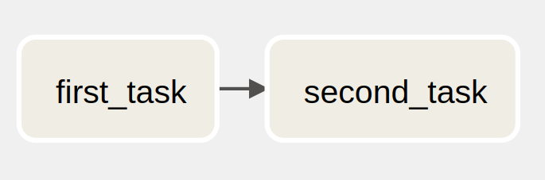
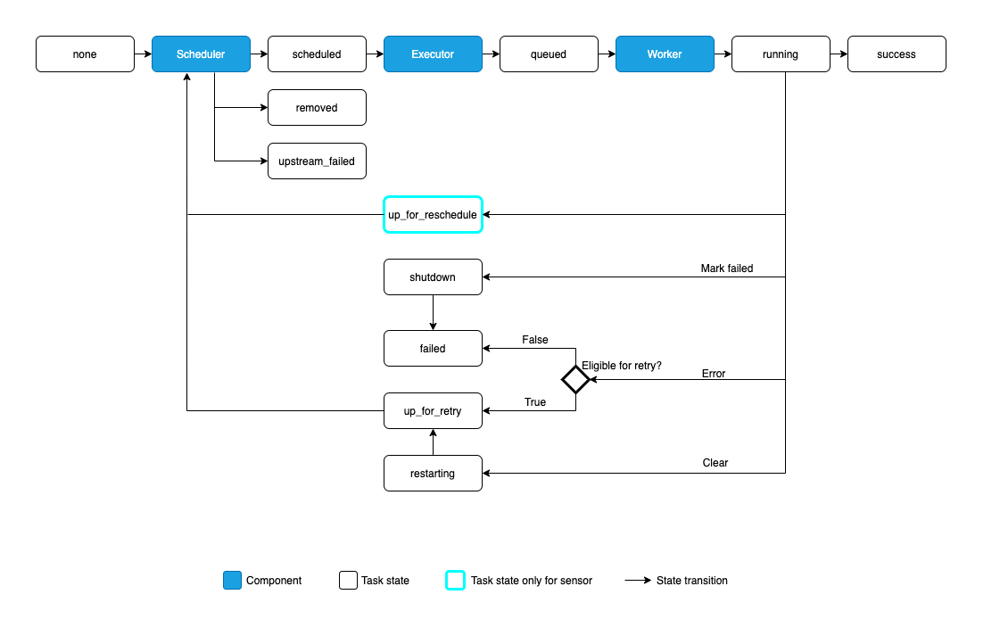

# Apache Airflow
Apache Airflow is an open-source platform for developing, scheduling, and monitoring batch-oriented workflows. 
Airflow’s extensible Python framework enables you to build workflows connecting with virtually any technology. 
If your workflows have a clear start and end, and run at regular intervals, they can be programmed as an Airflow DAG.

The main characteristic of Airflow workflows is that all workflows are defined in Python code. 
“Workflows as code” serves several purposes:

- Dynamic: DAGs are written in Python, allowing for dynamic pipeline creation.
- Extensible: The Airflow framework contains operators to connect with numerous technologies, easily create your own operators.
- Elegant: Airflow DAGs are lean and explicit

# Architecture

- Scheduler: The scheduler is at the core of Airflow and manages anything and everything related to DAG runs, tasks, the task runs, parsing, and storing DAGs
- Executor: An executor is a part of scheduler that handles and manages the running tasks
- Web Server: This is the UI of Airflow. A user interface where users can view, control and monitor all DAGs. This interface provides functionality to trigger dag or a task manually, clear DAG runs, view task states & logs and view tasks run duration
- Worker: Pick up tasks that are scheduled for execution and execute them
- Metadata DB: A database that stores workflow states, run duration, logs locations etc. This database also stores information regarding users, roles, connections, variables
- DAG Directory: A place where we store DAG

# Fundamental Concept

## DAGs (Directed Acyclic Graph)
A collection of all the tasks you want to run, organized in a way that reflects their relationships and dependencies.
The Python script purpose is to define DAG object

```
from airflow import DAG
from datetime import datetime
from airflow.operators.bash import BashOperator

with DAG(dag_id="FirstDAG", start_date=datetime(2023, 3, 27), schedule_interval="@hourly", tags=['truongvq']) as dag:

    firstTask = BashOperator(
        task_id="first_task",
        bash_command="echo 1",
    )

    secondTask = BashOperator(
        task_id="second_task",
        bash_command="echo 2",
    )

firstTask >> secondTask
```


### DAG Runs
A DAG Run is an object representing an instantiation of the DAG in time. 
Any time the DAG is executed, a DAG Run is created and all tasks inside it are executed. 
Each DAG Run is run separately from one another, meaning that you can have many runs of a DAG at the same time

Scheduled DAGs are run after the start date and at the end of interval

DAGs will run in one of two ways:
- When they are triggered either manually or via the API
- On a defined schedule, which is defined as part of the DAG

You may set your DAG to run on a simple schedule by setting its schedule argument to either a cron expression, or one of the following cron presets

| preset     | cron        |
|------------|-------------|
| @once      | 0 * * * *   |
| @daily     | 0 0 * * *   |
| @weekly    | 0 0 * * 0   |
| @monthly   | 0 0 1 * *   |
| @quarterly | 0 0 1 */3 * |
| @yearly    | 0 0 1 1 *   |

## Task
Task defines a unit of work within a DAG. It is represented as a node in the DAG
```
firstTask = BashOperator(
    task_id="first_task",
    bash_command="echo 1",
)

secondTask = BashOperator(
    task_id="second_task",
    bash_command="echo 2",
)

firstTask >> secondTask // or firstTask.set_downstream(secondTask) or secondTask.set_upstream(firstTask)
```

### Task Instances
An instance of a Task is a specific run of that task for a given DAG (and thus for a given data interval). They are also the representation of a Task that has state, representing what stage of the lifecycle it is in

### Task Lifecycle


## Operators
An operator describes a single task in a workflow

All operators inherit from the BaseOperator, which includes all the required arguments for running work in Airflow

Airflow has a very extensive set of operators available, with some built-in to the core or pre-installed providers like:
- BashOperator
- PythonOperator
- SparkSubmitOperator
- BranchPythonOperator
- ...

### Custom Operator
```
class SendCarFineNotificationOperator(BaseOperator):
    def __init__(self, car_fine, **kwargs) -> None:
        super().__init__(**kwargs)
        self.car_fine = car_fine

    def execute(self, context):
        url = "http://onroad-internal.10.240.177.74.nip.io/internal-service/onroad-sms/"
        body = {"number": "{}".format(self.car_fine[0]), "message": "Ban co {} thong tin phat nguoi".format(self.car_fine[2])},
        headers={"Content-Type": "application/json", "X-Authorization": "secretKey"}

        r = requests.post(url, data=body, headers=headers)
        return r.status_code
```

### Sensor
Sensors are a special type of Operator that are designed to do exactly one thing - wait for something to occur. It can be time-based, or waiting for a file, or an external event, but all they do is wait until something happens, and then succeed so their downstream tasks can run

```
sensorTask = FileSensor(
    task_id= "sensor_file", 
    poke_interval=10,
    timeout=50,
    mode="reschedule",
    filepath= "/home/truongvq/airflow-data/download/car-fine-data-short.json"
)
```

## XComs
XComs (short for “cross-communications”) are a mechanism that let Tasks talk to each other.
When Airflow runs a task, it collects several variables and pass a set of keyword arguments that can be used in your function (it is automatic from Airflow 2.0).

To communicate, we can publish values in our task using the ***xcom_push*** method, which is available on the task instance in the Airflow context. In other task, we will pull that value by using ***xcom_pull*** method

## Control flow
By default, a DAG will only run a Task when all the Tasks it depends on are successful. There are several ways of modifying this, however:

- Branching, where you can select which Task to move onto based on a condition

- Latest Only, a special form of branching that only runs on DAGs running against the present

- Depends On Past, where tasks can depend on themselves from a previous run

- Trigger Rules, which let you set the conditions under which a DAG will run a task.

### Branching
```
branch_by_day_of_month = BranchPythonOperator(
    task_id="branch_by_day_of_month",
    python_callable=branch_by_day_of_month_function,
)

def branch_by_day_of_month_function():
    day_of_month = datetime.today().day
    print(day_of_month)
    if day_of_month == 30:
        return "get_file_and_push_notification"
    else:
        return "get_file_and_update_db"
```
### Latest Only
```
from airflow import DAG
from datetime import datetime
from airflow.operators.bash import BashOperator
from airflow.operators.latest_only import LatestOnlyOperator

with DAG(dag_id="LatestOnlyExample", start_date=datetime(2023, 3, 27), schedule_interval="@hourly", tags=['truongvq']) as dag:

    firstTask = BashOperator(
        task_id="first_task",
        bash_command="echo 1",)

    latestOnlyTask = LatestOnlyOperator(
        task_id="latest_only",
    )

    secondTask = BashOperator(
        task_id="second_task",
        bash_command="echo 2",)

firstTask
latestOnlyTask >> secondTask
```
### Depends On Past

### Trigger Rules
- all_success (default): All upstream tasks have succeeded
- all_failed: All upstream tasks are in a failed or upstream_failed state
- all_done: All upstream tasks are done with their execution
- all_skipped: All upstream tasks are in a skipped state
- one_failed: At least one upstream task has failed (does not wait for all upstream tasks to be done)
- one_success: At least one upstream task has succeeded (does not wait for all upstream tasks to be done)
- one_done: At least one upstream task succeeded or failed
- none_failed: All upstream tasks have not failed or upstream_failed - that is, all upstream tasks have succeeded or been skipped
- none_failed_min_one_success: All upstream tasks have not failed or upstream_failed, and at least one upstream task has succeeded
- none_skipped: No upstream task is in a skipped state - that is, all upstream tasks are in a success, failed, or upstream_failed state
- always: No dependencies at all, run this task at any time

## Connection, Hook

### Connection
Airflow’s Connection object is used for storing credentials and other information necessary for connecting to external services.

```
from airflow import settings
from airflow.models import Connection

conn = Connection(
    conn_id="postgres_connection",
    conn_type="postgres",
    host="localhost",
    login="airflow",
    password="airflow",
    port=5432
) 
session = settings.Session()
session.add(conn)
session.commit()
```
### Hook
A Hook is a high-level interface to an external platform that lets you quickly and easily talk to them without having to write low-level code that hits their API or uses special libraries

```
sql = "SELECT * FROM car_fine"
pg_hook = PostgresHook(
    postgres_conn_id="postgres_connection",
    schema="postgres"
)
pg_conn = pg_hook.get_conn()
cursor = pg_conn.cursor()
cursor.execute(sql)
car_fine = cursor.fetchall()
```


