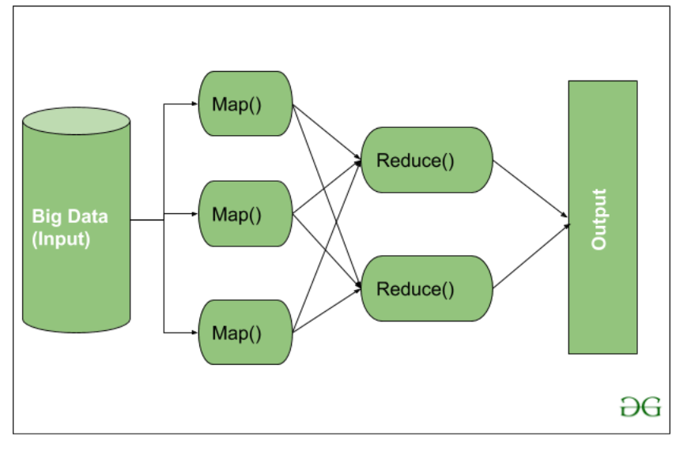

# HADOOP
>The Apache Hadoop software library is a framework that allows for the distributed processing of large data sets across clusters of computers using simple programming models. It is designed to scale up from single servers to thousands of machines, each offering local computation and storage. Rather than rely on hardware to deliver high-availability, the library itself is designed to detect and handle failures at the application layer, so delivering a highly-available service on top of a cluster of computers, each of which may be prone to failures.

Modules
- MapReduce
- HDFS (Hadoop Distributed File System)
- YARN (Yet Another Resource Negotiator)
- Common Utilities or Hadoop Common

## MapReduce

The major feature of MapReduce is to perform the distributed processing in parallel in a Hadoop cluster.

### MapTask

- RecordReader The purpose of recordreader is to break the records. It is responsible for providing key-value pairs in a Map() function. The key is actually is its locational information and value is the data associated with it.
- Map: A map is nothing but a user-defined function whose work is to process the Tuples obtained from record reader. The Map() function either does not generate any key-value pair or generate multiple pairs of these tuples.
- Combiner: Combiner is used for grouping the data in the Map workflow. It is similar to a Local reducer. The intermediate key-value that are generated in the Map is combined with the help of this combiner. Using a combiner is not necessary as it is optional.
- Partitionar: Partitional is responsible for fetching key-value pairs generated in the Mapper Phases. The partitioner generates the shards corresponding to each reducer. Hashcode of each key is also fetched by this partition. Then partitioner performs it’s(Hashcode) modulus with the number of reducers(key.hashcode()%(number of reducers)).

### Reduce Task
- Shuffle and Sort: The Task of Reducer starts with this step, the process in which the Mapper generates the intermediate key-value and transfers them to the Reducer task is known as Shuffling. Using the Shuffling process the system can sort the data using its key value.
Once some of the Mapping tasks are done Shuffling begins that is why it is a faster process and does not wait for the completion of the task performed by Mapper.
- Reduce: The main function or task of the Reduce is to gather the Tuple generated from Map and then perform some sorting and aggregation sort of process on those key-value depending on its key element.
- OutputFormat: Once all the operations are performed, the key-value pairs are written into the file with the help of record writer, each record in a new line, and the key and value in a space-separated manner.

## HDFS
HDFS (Hadoop Distributed File System) is utilized for storage permission.

### Name Node
NameNode works as a Master in a Hadoop cluster that guides the Datanode(Slaves). Namenode is mainly used for storing the Metadata i.e. the data about the data. Meta Data can be the transaction logs that keep track of the user’s activity in a Hadoop cluster.

Meta Data can also be the name of the file, size, and the information about the location(Block number, Block ids) of Datanode that Namenode stores to find the closest DataNode for Faster Communication. Namenode instructs the DataNodes with the operation like delete, create, Replicate, etc.

### Data Nodes
DataNodes works as a Slave DataNodes are mainly utilized for storing the data in a Hadoop cluster, the number of DataNodes can be from 1 to 500 or even more than that. The more number of DataNode, the Hadoop cluster will be able to store more data. So it is advised that the DataNode should have High storing capacity to store a large number of file blocks.

## YARN

## Hadoop common or Common Utilities
