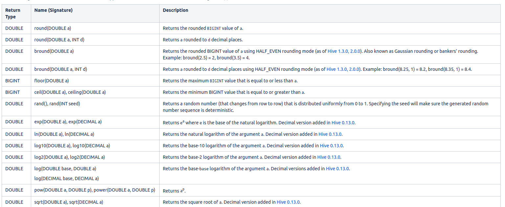
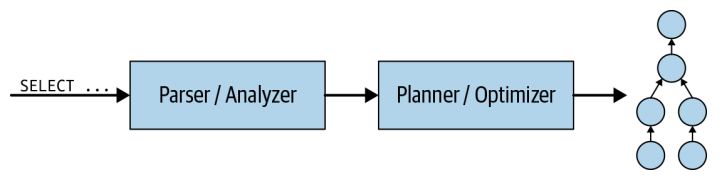
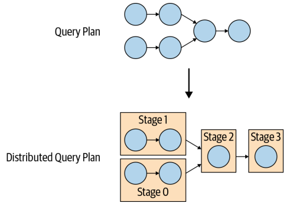
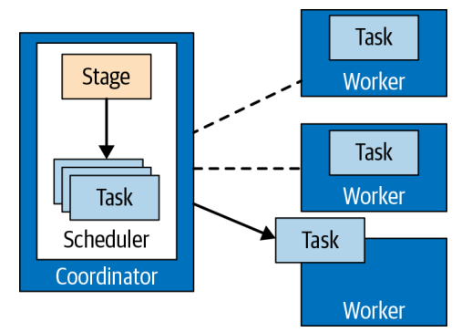
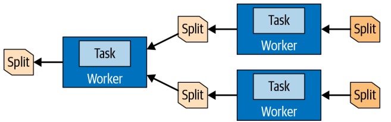
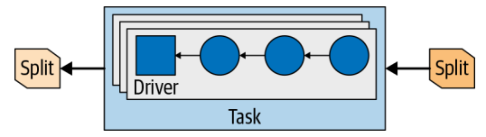
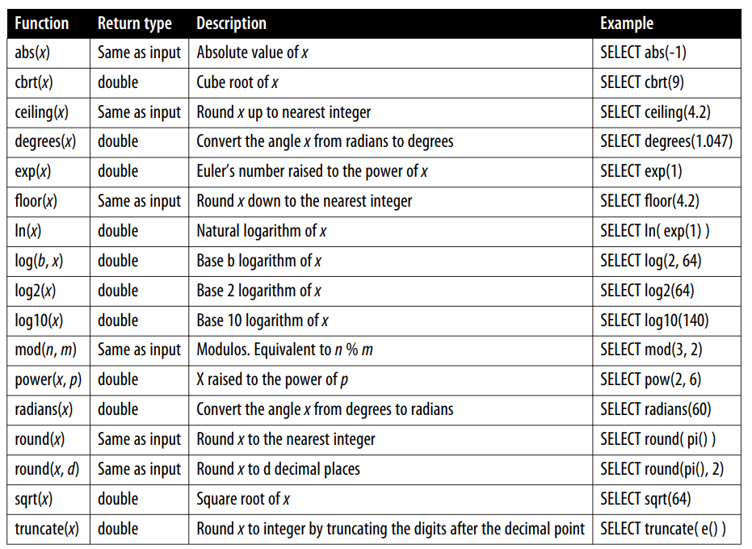

# APACHE HIVE

The Apache Hive data warehouse software facilitates reading, writing, and managing large datasets residing in distributed storage and queried using SQL syntax.

Hive provides the following features:

- Easy for who are familiar with SQL to work with large datasets, allow us to execute task like ETL, reporting, analysis, batch processing large datasets,...
- Built on top of Hadoop which can access to file stores in HDFS, use MapReduce as execution engine (you can choose another engine like Spark, Tez)
- Support multi file format like CSV/TSV, JSON, Parquet, ORC,...

## ARCHITECTURE


- **Hive Clients**: Support JDBC, ODBC driver or Thrift Client to communication with other application.
- **Hive Server**: Service that enables clients to execute queries against Hive.
- **CLI**: Run HiveQL queries over command line interface.
- **Hive Web Interface**: Another way to run HiveQL over web interface.
- **Driver**: Managing the execution of query and communication between Hive and the Hadoop ecosystem.
- **Metastore**: Store metadata for Hive tables (like their schema and location) and partitions in a relational database.
- **Execution Engine**: Convert query into a series of MapReduce (or Tez, Spark) job run in Hadoop.

## WORKFLOW


## HiveQL

[//]: # (| Type      | Description                        |)

[//]: # (|-----------|------------------------------------|)

[//]: # (| TINYINT   | 1 byte signed integer              |)

[//]: # (| SMALLINT  | 2 byte signed integer              |)

[//]: # (| INT       | 4 byte signed integer              |)

[//]: # (| BIGINT    | 8 byte signed integer              |)

[//]: # (| BOOLEAN   | TRUE or FALSE                      |)

[//]: # (| FLOAT     | Single precision floating point    |)

[//]: # (| DOUBLE    | Double precision floating point    |)

[//]: # (| STRING    | Sequence of characters             |)

[//]: # (| TIMESTAMP | Integer, float, or string          |)

[//]: # (| BINARY    | Sequence of bytes                  |)

[//]: # (| STRUCT    | Like an object                     |)

[//]: # (| MAP       | Collection of key-value            |)

[//]: # (| ARRAY     | Ordered sequences of the same type |)

### Schema

```
CREATE [REMOTE] (DATABASE|SCHEMA) [IF NOT EXISTS] database_name
  [COMMENT database_comment]
  [LOCATION hdfs_path]
  [MANAGEDLOCATION hdfs_path]
  [WITH DBPROPERTIES (property_name=property_value, ...)];
  
DROP (DATABASE|SCHEMA) [IF EXISTS] database_name [RESTRICT|CASCADE];
```

### Table
```
CREATE [TEMPORARY] [EXTERNAL] TABLE [IF NOT EXISTS] [db_name.]table_name 
  [(col_name data_type [column_constraint_specification] [COMMENT col_comment], ... [constraint_specification])]
  [COMMENT table_comment]
  [PARTITIONED BY (col_name data_type [COMMENT col_comment], ...)]
  [CLUSTERED BY (col_name, col_name, ...) [SORTED BY (col_name [ASC|DESC], ...)] INTO num_buckets BUCKETS]
   [ROW FORMAT row_format] 
   [STORED AS file_format]
  ]
  [LOCATION hdfs_path]
  [TBLPROPERTIES (property_name=property_value, ...)]
  [AS select_statement]; 
```

- **Managed table**:  If a managed table or partition is dropped, the data and metadata associated with that table or partition are deleted. Some HiveQL keyword only work for managed table (like ARCHIVE, UNARCHIVE, TRUNCATE, MERGE, CONCATENATE,...)
- **External table**: If a managed table or partition is dropped, only metadata for external table is deleted, data still exists in location.

### Load data

```
LOAD DATA [LOCAL] INPATH 'filepath' [OVERWRITE] INTO TABLE tablename [PARTITION (partcol1=val1, partcol2=val2 ...)]

INSERT (OVERWRITE|INTO) TABLE tablename1 [PARTITION (partcol1=val1, partcol2=val2 ...)] select_statement1 FROM from_statement;

IMPORT [[EXTERNAL] TABLE new_or_original_tablename [PARTITION (part_column="value"[, ...])]]
  FROM 'source_path'
  [LOCATION 'import_target_path']
```

### Export data
```
INSERT OVERWRITE [LOCAL] DIRECTORY directory1
  [ROW FORMAT row_format] [STORED AS file_format]
  SELECT ... FROM ...
  
EXPORT TABLE tablename [PARTITION (part_column="value"[, ...])]
  TO 'export_target_path'
```
### Queries
```
[WITH CommonTableExpression (, CommonTableExpression)*]    
SELECT [ALL | DISTINCT] select_expr, select_expr, ...
  FROM table_reference
  [WHERE where_condition]
  [GROUP BY col_list]
  [ORDER BY col_list]
 [LIMIT [offset,] rows]
```



# PRESTO
Presto is a distributed SQL query engine designed to query large data sets distributed over one or more heterogeneous data sources.

Presto provides the following features:
- Presto is a query engine that query data support many kind of data sources like  object storage, HDFS, RDBMs, NoSQL databases,... using SQL.
- Presto queries data where it lives and does not require data in a single location
- Fast

## PRESTO CONCEPTS
- **Coordinator**: Responsible for receiving SQL statements from the users, parsing these statements, planning queries, and managing worker nodes. Client can connect to coordinator via Presto CLI, JDBC, ODBC,...
- **Worker**: Responsible for executing tasks assigned by the coordinator and for processing data.
- **Connector**: Responsible for integrating Presto with external data sources. Presto provides a service provider interface (SPI), a type of API used to implement a connector. Every connector should take care of:
    - Fetch table/view/schema metadata.
    - Split data into a chunk that Presto will distribute to worker.
    - Data sources and how to convert the source data to/from the in-memory format expected by the query engine.
- **Catalog**: Represents a datasource configured connect via a connector.
- **Schema**: Schemas hold tables, views, and various other objects and are a way to organize tables. Together, the catalog and schema define a set of tables that can be queried. Catalogs contain one or more schemas.
- **Table**: Set of unordered rows, which are organized into named columns with specific data types.
- **Statement**: Statement is the text format represent of a SQL statement.
- **Query**: When we parse a statement, it converts into a query and creates a query plan among Presto workers. A statement is simply text while a query refers to the configuration and components instantiated to execute that statement.
- **Stage**: When executes a query, Presto creates a distributed query plan which is a series of hierarchy stages. A stage is represents a portion of a query plan.
- **Task**: Stage is a series of tasks that run across Presto workers. A task represents a portion of the data that needs to be processed for the stage.
- **Split**: A split is a chunk of input data that can be retrieved and processed by task. 
- **Driver**: A driver is a sequence of operator execute in a task and perform the processing data in the split.
- **Operator**: An operator consumes, transforms and produces data in a task.
## ARCHITECTURE AND WORKFLOW







## MANIPULATION
```
[ WITH with_query [, ...] ]
SELECT [ ALL | DISTINCT ] select_expr [, ...]
[ FROM from_item [, ...] ]
[ WHERE condition ]
[ GROUP BY [ ALL | DISTINCT ] grouping_element [, ...] ]
[ HAVING condition]
[ { UNION | INTERSECT | EXCEPT } [ ALL | DISTINCT ] select ]
[ ORDER BY expression [ ASC | DESC ] [, ...] ]
[ LIMIT [ count | ALL ] ]
```

