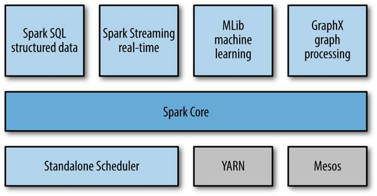
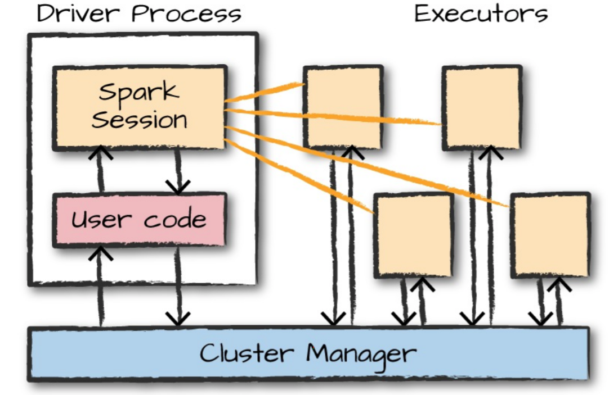

# APACHE SPARK
Apache Spark is an Open source analytical processing engine for large scale powerful distributed data processing and machine learning applications.

The goal of Spark was to create a new framework, optimized for fast iterative processing like machine learning, and interactive data analysis, while retaining the scalability, and fault tolerance of Hadoop MapReduce

Hadoop MapReduce is a programming model for processing big data sets with a parallel, distributed algorithm. Developers can write massively parallelized operators, without having to worry about work distribution, and fault tolerance. However, a challenge to MapReduce is the sequential multi-step process it takes to run a job. With each step, MapReduce reads data from the cluster, performs operations, and writes the results back to HDFS. Because each step requires a disk read, and write, MapReduce jobs are slower due to the latency of disk I/O.

Spark was created to address the limitations to MapReduce, by doing processing in-memory, reducing the number of steps in a job, and by reusing data across multiple parallel operations. With Spark, only one-step is needed where data is read into memory, operations performed, and the results written back—resulting in a much faster execution. Spark also reuses data by using an in-memory cache to greatly speed up machine learning algorithms that repeatedly call a function on the same dataset. Data re-use is accomplished through the creation of DataFrames, an abstraction over Resilient Distributed Dataset (RDD), which is a collection of objects that is cached in memory, and reused in multiple Spark operations. This dramatically lowers the latency making Spark multiple times faster than MapReduce, especially when doing machine learning, and interactive analytics.
## Spark Component

- **Spark Core**: Spark Core provides the execution engine for the Spark platform which is required and used by other components which are built on top of Spark Core as per the requirement. Spark Core uses a very special data structure called the RDD.
- **Spark SQL**: Spark SQL is Apache Spark's module for working with structured data
- **Spark Streaming**: Spark Streaming is an extension of the core Spark API that enables scalable, high-throughput, fault-tolerant stream processing of live data streams
- **Mlib**: MLlib is Apache Spark's scalable machine learning library.
- **GraphX**: GraphX is Apache Spark's API for graphs and graph-parallel computation.
## Spark architecture


### Driver process
The driver process is absolutely essential, maintains all relevant information during the lifetime of the application
- Maintaining information about the Spark Application
- Responding to a user’s program or input 
- Analyzing, distributing, and scheduling work across the executors

### Executors 
The executors are responsible for actually carrying out the work that the driver assigns them.
- Executing code assigned to it by the driver
- Reporting the state of the computation on that executor back to the driver node

### Cluster manager

The main task of cluster manager is to provide resources to all applications

## Spark Core
### SparkSession

You control your Spark Application through a driver process called the SparkSession. The SparkSession instance is the way Spark executes user-defined manipulations across the cluster

### DataFrames
The most common Structured API. Represents a table of data with rows and columns

### Partitions
Spark breaks up the data into chunks called partitions

### Transformations
The core data structures are immutable. To “change” a data structure, you need to "transformation" it.

- Narrow dependencies
  - Each input partition will contribute to only one output partition.
  - Spark will automatically perform an operation called pipelining, meaning that if we specify multiple filters on DataFrames, they’ll all be performed in-memory
- Wide dependencies
  - Input partitions contributing to many output partitions.
  - You will often hear this referred to as a shuffle whereby Spark will exchange partitions across the cluster. When we perform a shuffle, Spark writes the results to disk

**Lazy Evaluation**: In Spark, instead of modifying the data immediately when you express some operation, you build up a plan of transformations that you would like to apply to your source data. By
waiting until the last minute to execute the code, Spark compiles this plan from your raw DataFrame
transformations to a streamlined physical plan that will run as efficiently as possible across the
cluster
### Actions
Transformations allow us to build up our logical transformation plan. To trigger the computation, we
run an *action*.
There are three kinds of actions:
- Actions to view data in the console
- Actions to collect data to native objects in the respective language
- Actions to write to output data sources

Two fundamental sets of APIs:
- Low-level "unstructed" APIs.
- Higher-level structured APIs.
## Spark Low-level APIs

### SparkContext
Main entry point for Spark functionality. A SparkContext represents the connection to a Spark cluster, and can be used to create RDD

### RDD(Resilient Distributed Datasets)
Represents an immutable, partitioned collection of records which computes on the different node of the cluster
- Resilient: The fault-tolerant as they can track data lineage information to allow for rebuilding lost data automatically on failure. To achieve fault tolerance for the generated RDD’s, the achieved data is replicated among various Spark executors in worker nodes in the cluster
- Distributed: Data present in RDD resides on multiple nodes. It is distributed across different nodes of a cluster
- Datasets: Represents records of the data
### Creating RDDs
One of the easiest ways to get RDDs is from an existing DataFrame or Dataset
```
// Converts a Dataset[Long] to RDD[Long]
spark.range(500).rdd

spark.range(10).toDF().rdd.map(rowObject => rowObject.getLong(0))
```
Create an RDD from a collection
```
val myCollection = "Spark The Definitive Guide : Big Data Processing Made Simple"
.split(" ")
val words = spark.sparkContext.parallelize(myCollection, 2)
```
Or from data source
```
// This creates an RDD for which each record in the RDD represents a line in that text file or files
spark.sparkContext.textFile("/some/path/withTextFiles")

// This creates an RDD for which each text file should become a single record
spark.sparkContext.wholeTextFiles("/some/path/withTextFiles")
```

### Transformations
- distinct: A distinct method call on an RDD removes duplicates from the RDD
```
words.distinct().count()
```
- filter: Find in our record which ones match some predicate function
```
def startsWithS(individual:String) = {
    individual.startsWith("S")
}

words.filter(word => startsWithS(word)).collect()
```
- map: Returns the value that you want from each record
```
// map the current word to the word and its starting letter. Ex: “Spark,” “S,”
val words2 = words.map(word => (word, word(0)))
```
- flatMap: Flattens the records
```
words.flatMap(word => word.toSeq).take(5)
```
- sort: Sort an RDD
```
words.sortBy(word => word.length() * -1).take(2)
```
- mapPartitions: Execute map once per each partitions
```
words.mapPartitions(iterator => iterator.map(word => (word, word(0))))
```
- foreachPartition: Iterates over all the partitions of the data
```
  words.foreachPartition { iter =>
    while (iter.hasNext) {
      println(iter.next())
    }
  }
```
- glom: Takes data in each partition of your dataset and converts them to arrays
```
words.glom().collect()
// Array(Array("Spark", "The", "Definitive", "Guide", ":"), Array("Big", "Data", "Processing", "Made", "Simple"))
```
### Actions
- reduce: Reduce an RDD of any kind of value to one value
```
spark.sparkContext.parallelize(1 to 20).reduce(_ + _) // 210

def wordLengthReducer(leftWord:String, rightWord:String): String = {
    if (leftWord.length > rightWord.length)
        return leftWord
    else
        return rightWord
}
words.reduce(wordLengthReducer)
```
- count: Count the number of records in the RDD
```
words.count()
```
- countByValue: Counts the number of values in a given RDD
```
words.countByValue()
```
- max and min: Return the maximum values and minimum values
```
spark.sparkContext.parallelize(1 to 20).max() // 20
spark.sparkContext.parallelize(1 to 20).min() // 1
```
- take: Take a number of values from your RDD. It works by first scanning one partition, and use the results from that partition to estimate the number of additional partitions needed to satisfy the limit.
```
words.take(5) // Take the first 5 elements of the RDD.
words.takeOrdered(5) // Get the 5 elements from an RDD ordered in ascending order or as specified by the optional key function.
words.top(5) // Get the top 5 elements from an RDD.
val withReplacement = true
val numberToTake = 6
val randomSeed = 100L
words.takeSample(withReplacement, numberToTake, randomSeed) // Return a fixed-size sampled subset of this RDD.
```

[//]: # (### Saving Files)

[//]: # (- saveAsTextFile: Save to a text file)

[//]: # (```)

[//]: # (words.saveAsTextFile&#40;"file:/tmp/bookTitle"&#41;)

[//]: # (```)

[//]: # (- SequenceFiles: A sequenceFile is a flat file consisting of binary key–value pairs. It is extensively used in MapReduce as input/output formats)

[//]: # (```)

[//]: # (words.saveAsObjectFile&#40;"/tmp/my/sequenceFilePath"&#41;)

[//]: # (```)
[//]: # (### Pipe RDDs to System Commands)
### Key-Value RDDs
keyBy: Create a key for a records and keeps the record as the value for the keyed RDD
```
val keyword = words.keyBy(word => word.toLowerCase.toSeq(0).toString)
```
mapValues: Map over the values 
```
keyword.mapValues(word => word.toUpperCase).collect()
```
Extracting Keys and Values: 
```
keyword.keys.collect()
keyword.values.collect()
```
lookup: Look up the result for a particular key
```
keyword.lookup("s") // WrappedArray(Spark, Simple)
```
countByKey: Count the number of elements for each key
```
val chars = words.flatMap(word => word.toLowerCase.toSeq)
val KVcharacters = chars.map(letter => (letter, 1))
KVcharacters.countByKey()
```
groupByKey: Group the values for each key in the RDD into a single sequence
```
KVcharacters.groupByKey().map(row => (row._1, row._2.sum)).collect()
```
reduceByKey: Merge the values for each key using an associative and commutative reduce function.
```
KVcharacters.reduceByKey((x,y) => x + y).collect()
```
aggregate: The first aggregates within partitions, the second aggregates across partitions. The start value will be used at both aggregation levels
```
val nums = sc.parallelize(1 to 30, 5)
nums.aggregate(0)((x, y) => x.max(y), (x,y) => x + y) // Sum max of each partition
```
aggregateByKey: Same as aggregate but instead of doing it partition by partition, it does it by key
```
KVcharacters.aggregateByKey(0)((x,y) => x + y), (x, y) => x.max(y)).collect()
```
### Joins
```
val distinctChars = words.flatMap(word => word.toLowerCase.toSeq).distinct
val keyedChars = distinctChars.map(c => (c, 0))
val outputPartitions = 10
KVcharacters.join(keyedChars).count()
KVcharacters.join(keyedChars, outputPartitions).count()
```
- fullOuterJoin
- leftOuterJoin
- rightOuterJoin
- cartesian
### Controlling Partitions
- coalesce: Return a new RDD that is reduced into numPartitions partitions
```
words.coalesce(1).getNumPartitions 
```
- repartition: Return a new RDD that has exactly numPartitions partitions.
```
words.repartition(10)
```
- Custom Partitioning: This ability is one of the primary reasons you’d want to use RDDs. The goal of custom partitioning is to even out the distribution of your data across the cluster so that you can work around problems like data skew.

